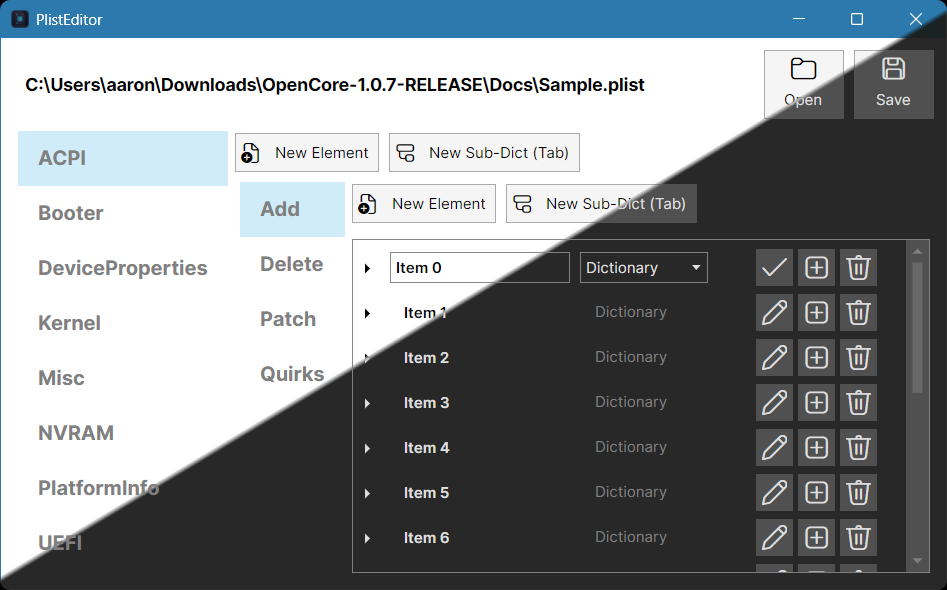

#  PlistEditor

A cross-platform desktop application for viewing and editing Apple property list (`.plist`) files, built with [Avalonia UI](https://avaloniaui.net/) and .NET 10.



## Features

- Open and browse `.plist` files through a native file picker
- View plist entries organized into sections based on top-level keys
- Edit plist values using the MVVM pattern (powered by [CommunityToolkit.Mvvm](https://github.com/CommunityToolkit/dotnet))
- Fluent-themed UI with [FluentIcons](https://github.com/davidxuang/FluentIcons) for a modern, native-feeling experience
- Runs on Windows, macOS, and Linux thanks to Avalonia

## Project Structure

- **PlistEditor** — the core Avalonia application, including views, view models, and controls
- **PlistEditor.Desktop** — the desktop entry point used to launch the application

## Getting Started

### Prerequisites

- [.NET 10 SDK](https://dotnet.microsoft.com/download)

### Build and Run

```powershell
dotnet run --project PlistEditor.Desktop
```

### Open the Solution

Open `PlistEditor.slnx` in Visual Studio 2026 (or later) to build and debug the application directly.

## License

This project is licensed under the [GNU General Public License v3.0](LICENSE).